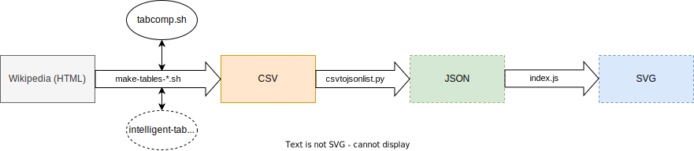
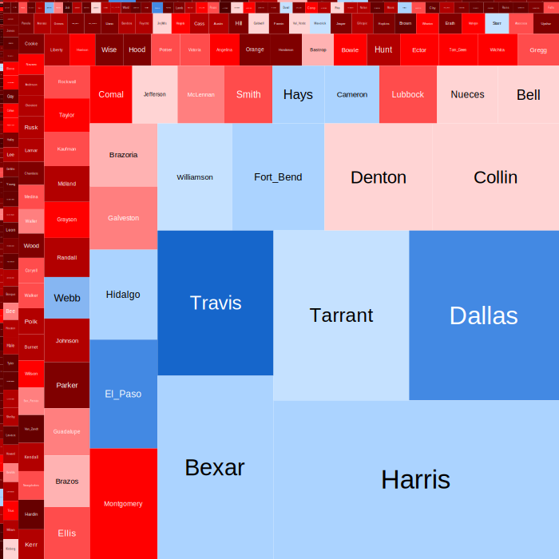

# Treemaps

The code behind [this part of my website.](https://bengordon.dev/projects/elections/treemaps)

## Code explanation

The make-tables scripts do the heavy lifting. They each do the same thing, pulling down U.S. presidential election data (for a range of years in one state) from Wikipedia and transforming it into a form that is easy to work with. 

The Python and JS code works together to transform a directory of CSV data files into a directory of beautiful SVG treemap images. 

The [Python script](https://github.com/bengordon-dev/elections/blob/master/treemapping-tools/csvtojsonlist.py) turns the CSV files into an intermediate form which looks like [this.](https://github.com/bengordon-dev/elections/tree/master/treemapping-tools/images/newGA.js) Due to non-uniformity in the Wikipedia data, the amount
of work it has to do varies greatly. Its functions include the following:
* Calculating the margin of victory and/or the total number of votes cast in each county when columns for that data are absent from an inputted table 
* Throwing out any information not required for the final treemap images

The [JS code](https://github.com/bengordon-dev/elections/blob/master/treemapping-tools/index.js), which converts the intermediate form into a directory of SVG images, uses the [treemap-squarify](https://www.npmjs.com/package/treemap-squarify) NPM package. Unlike the Python code, it does not take in command-line arguments for its inputs; I am looking to change that. 

## Example output
[Data source (2020 U.S. Presidential Election in Texas)](https://en.wikipedia.org/wiki/2020_United_States_presidential_election_in_Texas#Results_by_county)

