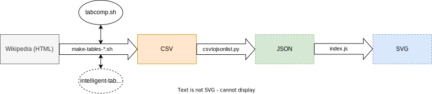
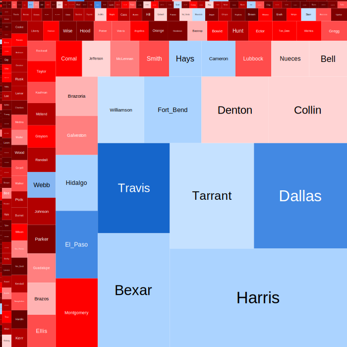

# Treemaps

The code behind [this part of my website.](https://bengordon.dev/projects/elections/treemaps)

## Code explanation

## Example output
[Data source (2020 U.S. Presidential Election in Texas)](https://en.wikipedia.org/wiki/2020_United_States_presidential_election_in_Texas#Results_by_county)

